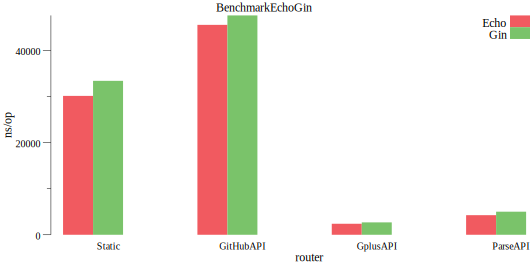

# Web Framework Benchmark

modified from <https://github.com/vishr/web-framework-benchmark>

## Changelog

- Visualized the benchmarking with GNU plot
- Upgraded `Echo` to v4 latest version and `Gin` to the latest verrsion

> `gin` vs `echo`

```go

github.com/gin-gonic/gin v1.6.3

github.com/labstack/echo/v4 v4.1.16
```

## Requirement

- `go module support`

## Installation

```bash
git clone https://github.com/ttys3/web-framework-benchmark.git
```

## Running Benchmark

```bash
cd web-framework-benchmark
go test -bench=.

# to see graph
# make
```

## Sample Result

the graph was generated with <https://github.com/ttys3/benchdraw>

### ns/op (the lower the better)



hardware

```bash
❯ neofetch
          /:-------------:\          ttys3@8700k.localhost 
       :-------------------::        --------------------- 
     :-----------/shhOHbmp---:\      OS: Fedora 32 (Workstation Edition) x86_64 
   /-----------omMMMNNNMMD  ---:     Kernel: 5.7.14-200.fc32.x86_64 
  :-----------sMMMMNMNMP.    ---:    Uptime: 3 days, 16 mins 
 :-----------:MMMdP-------    ---\   Packages: 2626 (rpm) 
,------------:MMMd--------    ---:   Shell: zsh 5.8 
:------------:MMMd-------    .---:   Resolution: 3840x2160 
:----    oNMMMMMMMMMNho     .----:   DE: GNOME 
:--     .+shhhMMMmhhy++   .------/   WM: Mutter 
:-    -------:MMMd--------------:    WM Theme: Adwaita 
:-   --------/MMMd-------------;     Theme: Adwaita [GTK2/3] 
:-    ------/hMMMy------------:      Icons: Adwaita [GTK2/3] 
:-- :dMNdhhdNMMNo------------;       Terminal: gnome-terminal 
:---:sdNMMMMNds:------------:        CPU: Intel i7-8700K (12) @ 4.700GHz 
:------:://:-------------::          GPU: Intel UHD Graphics 630 
:---------------------://            GPU: NVIDIA GeForce GTX 1060 3GB 
                                     Memory: 19911MiB / 31531MiB 
```

```bash
❯ go test -bench=.
goos: linux
goarch: amd64
pkg: github.com/vishr/web-framework-benchmark
BenchmarkEchoGin/framework=Echo/router=Static-12         	   39493	     30663 ns/op	    2135 B/op	     157 allocs/op
BenchmarkEchoGin/framework=Gin/router=Static-12          	   35595	     32880 ns/op	    8512 B/op	     157 allocs/op
BenchmarkEchoGin/framework=Echo/router=GitHubAPI-12      	   25204	     47620 ns/op	    3003 B/op	     203 allocs/op
BenchmarkEchoGin/framework=Gin/router=GitHubAPI-12       	   24991	     46444 ns/op	   11135 B/op	     203 allocs/op
BenchmarkEchoGin/framework=Echo/router=GplusAPI-12       	  509173	      2402 ns/op	     172 B/op	      13 allocs/op
BenchmarkEchoGin/framework=Gin/router=GplusAPI-12        	  446631	      2540 ns/op	     701 B/op	      13 allocs/op
BenchmarkEchoGin/framework=Echo/router=ParseAPI-12       	  291855	      4198 ns/op	     326 B/op	      26 allocs/op
BenchmarkEchoGin/framework=Gin/router=ParseAPI-12        	  244062	      5066 ns/op	    1390 B/op	      26 allocs/op
PASS
ok  	github.com/vishr/web-framework-benchmark	12.273s


❯ go test -bench=.
goos: linux
goarch: amd64
pkg: github.com/vishr/web-framework-benchmark
BenchmarkEchoGin/framework=Echo/router=Static-12         	   40330	     28822 ns/op	    2117 B/op	     157 allocs/op
BenchmarkEchoGin/framework=Gin/router=Static-12          	   34998	     33580 ns/op	    8528 B/op	     157 allocs/op
BenchmarkEchoGin/framework=Echo/router=GitHubAPI-12      	   26522	     46176 ns/op	    2934 B/op	     203 allocs/op
BenchmarkEchoGin/framework=Gin/router=GitHubAPI-12       	   24867	     47791 ns/op	   11142 B/op	     203 allocs/op
BenchmarkEchoGin/framework=Echo/router=GplusAPI-12       	  509270	      2382 ns/op	     172 B/op	      13 allocs/op
BenchmarkEchoGin/framework=Gin/router=GplusAPI-12        	  432816	      2561 ns/op	     704 B/op	      13 allocs/op
BenchmarkEchoGin/framework=Echo/router=ParseAPI-12       	  278415	      4181 ns/op	     332 B/op	      26 allocs/op
BenchmarkEchoGin/framework=Gin/router=ParseAPI-12        	  209114	      5131 ns/op	    1414 B/op	      26 allocs/op
PASS
ok  	github.com/vishr/web-framework-benchmark	11.078s


❯ go test -bench=.
goos: linux
goarch: amd64
pkg: github.com/vishr/web-framework-benchmark
BenchmarkEchoGin/framework=Echo/router=Static-12         	   38719	     30131 ns/op	    2153 B/op	     157 allocs/op
BenchmarkEchoGin/framework=Gin/router=Static-12          	   34903	     33395 ns/op	    8531 B/op	     157 allocs/op
BenchmarkEchoGin/framework=Echo/router=GitHubAPI-12      	   25060	     45541 ns/op	    3011 B/op	     203 allocs/op
BenchmarkEchoGin/framework=Gin/router=GitHubAPI-12       	   24819	     47589 ns/op	   11145 B/op	     203 allocs/op
BenchmarkEchoGin/framework=Echo/router=GplusAPI-12       	  505262	      2389 ns/op	     172 B/op	      13 allocs/op
BenchmarkEchoGin/framework=Gin/router=GplusAPI-12        	  438598	      2689 ns/op	     703 B/op	      13 allocs/op
BenchmarkEchoGin/framework=Echo/router=ParseAPI-12       	  290649	      4251 ns/op	     327 B/op	      26 allocs/op
BenchmarkEchoGin/framework=Gin/router=ParseAPI-12        	  225582	      5007 ns/op	    1401 B/op	      26 allocs/op
PASS
ok  	github.com/vishr/web-framework-benchmark	11.207s
```